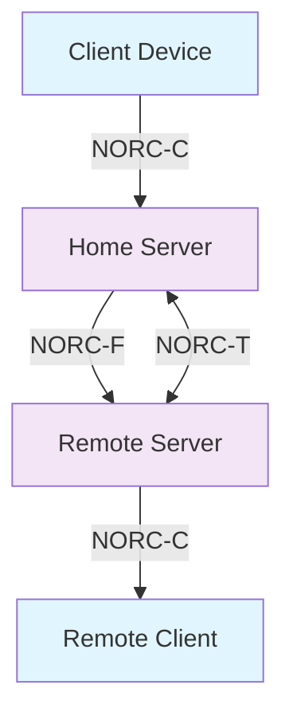

# NORC Protocol Specifications Index

This directory contains the official specifications for the NORC (NavaTron Open Real-time Communication) protocol suite.

## 📋 Specifications Overview

### Core Protocol Documents

| Document | Description | Status |
|----------|-------------|---------|
| [PROTOCOL_SPECIFICATION.md](../PROTOCOL_SPECIFICATION.md) | Main protocol specification covering all three layers | Draft v1.0 |
| [IMPLEMENTATION_GUIDE.md](../IMPLEMENTATION_GUIDE.md) | Technology-independent implementation guide | Draft v1.0 |

### Layer-Specific Specifications

| Layer | Document | Description | Status |
|-------|----------|-------------|---------|
| **NORC-C** | [NORC-C_CLIENT_SERVER.md](./NORC-C_CLIENT_SERVER.md) | Client ↔ Server Protocol | Draft v1.0 |
| **NORC-F** | [NORC-F_SERVER_FEDERATION.md](./NORC-F_SERVER_FEDERATION.md) | Server ↔ Server Federation | Draft v1.0 |
| **NORC-T** | [NORC-T_TRUST_ESTABLISHMENT.md](./NORC-T_TRUST_ESTABLISHMENT.md) | Trust Establishment & Management | Draft v1.0 |

## 🏗️ Protocol Architecture

```
                    NORC Protocol Stack
    ┌─────────────────────────────────────────────────┐
    │               Application Layer                 │
    │        (Chat, Calls, File Transfer)             │
    ├─────────────────────────────────────────────────┤
    │  NORC-C        NORC-F         NORC-T           │
    │ Client-Server  Federation    Trust Management   │
    ├─────────────────────────────────────────────────┤
    │            Common Protocol Layer                │
    │     (Message Format, Routing, Encryption)       │
    ├─────────────────────────────────────────────────┤
    │              Cryptography Layer                 │
    │    (Ed25519, X25519, ChaCha20-Poly1305)        │
    ├─────────────────────────────────────────────────┤
    │               Transport Layer                   │
    │         WebSocket/TLS, HTTP/2/mTLS              │
    └─────────────────────────────────────────────────┘
```

## 🔗 Protocol Relationships

### Message Flow Example



1. **Trust Establishment**: Servers use NORC-T to establish cryptographic trust
2. **Client Connection**: Clients connect to their home server via NORC-C
3. **Message Routing**: Servers relay messages through NORC-F federation
4. **End-to-End Security**: All content encrypted between client devices

## 📊 Specification Status

| Component | Specification | Implementation | Testing |
|-----------|--------------|----------------|---------|
| NORC-C Core | ✅ Complete | 🔄 In Progress | ⏳ Planned |
| NORC-F Core | ✅ Complete | 🔄 In Progress | ⏳ Planned |
| NORC-T Core | ✅ Complete | 🔄 In Progress | ⏳ Planned |
| Extensions | ⏳ Planned | ❌ Not Started | ❌ Not Started |

## 🔧 Implementation Status

### Reference Implementation (Erlang/OTP)
- **Repository**: [NavaTron/norc-server](https://github.com/NavaTron/norc-server) (planned)
- **Language**: Erlang/OTP 26+
- **Status**: In development
- **Target**: Q2 2025

### Client SDKs (Planned)
- **Erlang/Elixir**: Native implementation
- **Python**: asyncio-based client
- **JavaScript**: Web and Node.js clients  
- **Rust**: High-performance native client
- **Go**: Enterprise client library

## 📚 Additional Documents

### Compliance and Security
- `SECURITY_CONSIDERATIONS.md` (planned)
- `NATO_COMPLIANCE_GUIDE.md` (planned)
- `FIPS_140_2_COMPLIANCE.md` (planned)

### Developer Resources
- `API_REFERENCE.md` (planned)
- `SDK_DEVELOPMENT_GUIDE.md` (planned)
- `DEPLOYMENT_GUIDE.md` (planned)
- `TROUBLESHOOTING.md` (planned)

### Extensions
- `EXTENSIONS/` directory (planned)
  - Group messaging optimizations
  - Media streaming protocols
  - IoT device integration
  - Post-quantum cryptography migration

## 🎯 Design Goals Summary

- **Security First**: End-to-end encryption is mandatory, metadata is minimized
- **Federation Ready**: Built-in support for trusted server-to-server communication
- **Compliance Capable**: NATO/government PKI integration, audit trails, classification support
- **Erlang Optimized**: Leverages Erlang/OTP's strengths while remaining language-agnostic
- **Modern Cryptography**: Ed25519, X25519, ChaCha20-Poly1305, forward secrecy
- **Scalable**: Designed for high-throughput, low-latency communication

## 🚀 Getting Started

1. **Read the Overview**: Start with [PROTOCOL_SPECIFICATION.md](../PROTOCOL_SPECIFICATION.md)
2. **Choose Your Layer**: Review the specific layer documents based on your needs
3. **Implementation Guide**: Follow [IMPLEMENTATION_GUIDE.md](../IMPLEMENTATION_GUIDE.md)
4. **Reference Implementation**: Check the Erlang/OTP implementation (when available)

## 📝 Contributing

To contribute to NORC specifications:

1. **Issues**: Report issues or suggest improvements via GitHub Issues
2. **Discussions**: Join protocol discussions in GitHub Discussions  
3. **Pull Requests**: Submit specification improvements via PRs
4. **RFCs**: Propose major changes through RFC process (details TBD)

## 📧 Contact

- **Project Lead**: [Your Contact Info]
- **Security Issues**: security@navatron.org (planned)
- **General Questions**: protocol@navatron.org (planned)

---

**Last Updated**: August 22, 2025  
**Version**: 1.0 Draft  
**License**: Apache 2.0
